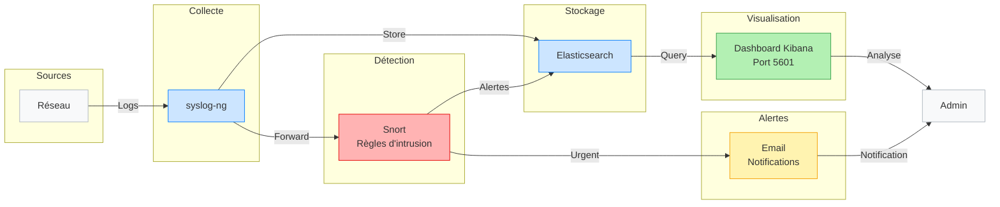
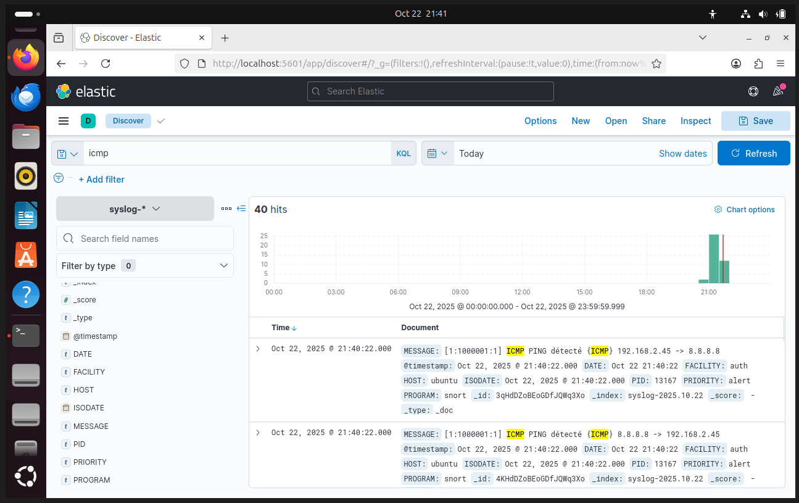
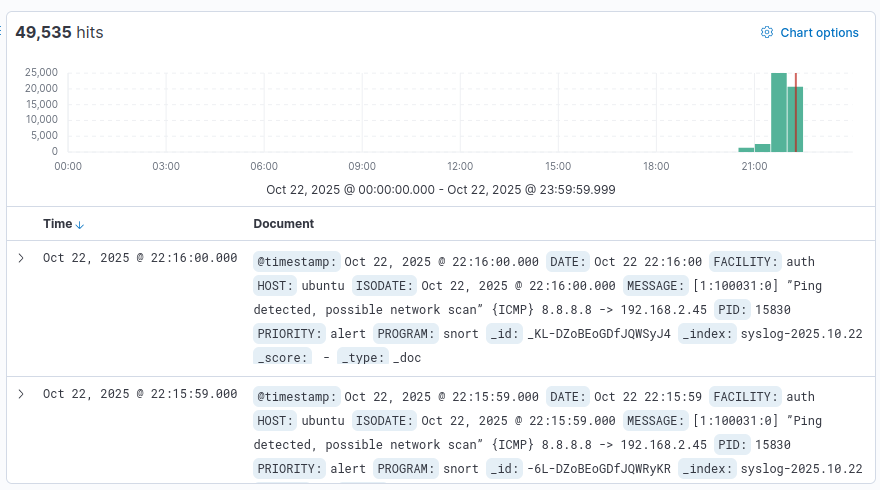
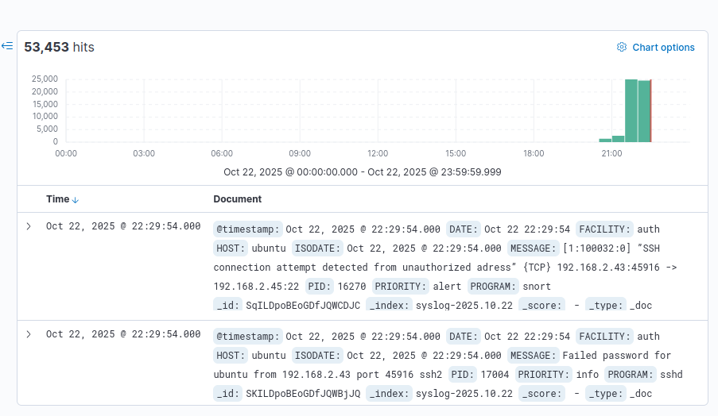
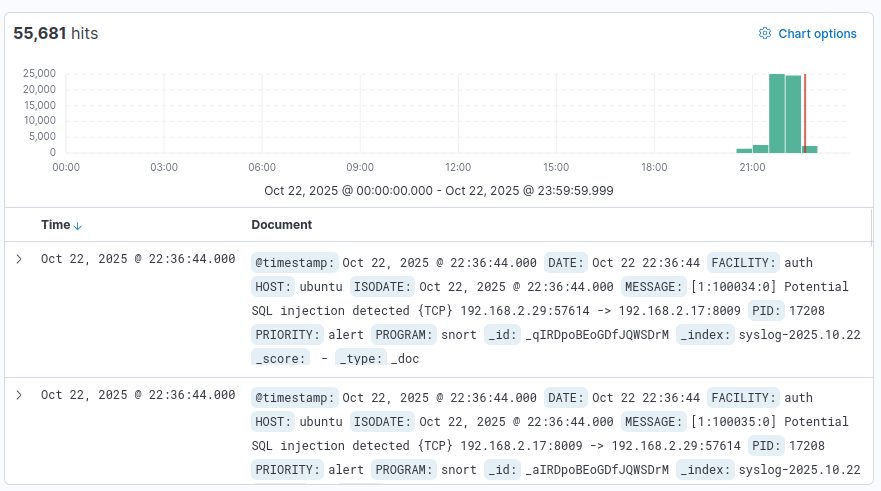
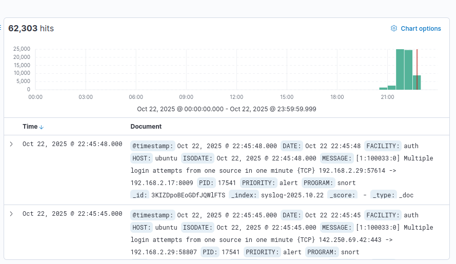
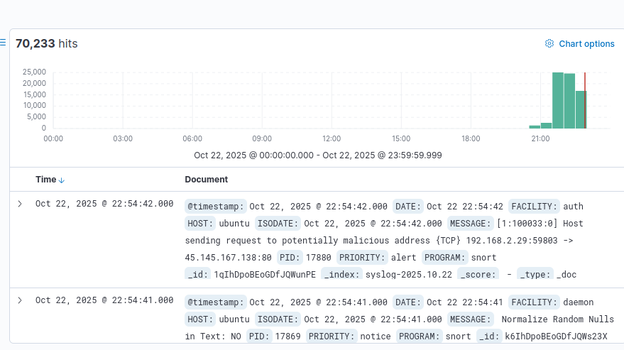

_8INF857 - Sécurité Informatique_

# Système de détection d'anomalies et de gestion de logs

## Table des matières
- [Description du projet](#description-du-projet)
- [Architecture](#architecture)
- [Prérequis](#prérequis)
- [Installation](#installation)
- [Configuration](#configuration)
- [Scénarios d'intrusion](#scénarios-dintrusion)
- [Utilisation](#utilisation)
- [Visualisation avec Kibana](#visualisation-avec-kibana)
- [Alertes et notifications](#alertes-et-notifications)
- [Structure du dépôt](#structure-du-dépôt)
- [Analyse et conclusion](#analyse-et-conclusion)
- [Équipe](#équipe)

---

## Description du projet

### Objectif

Ce projet vise à concevoir et implémenter un système de détection d'anomalies et de gestion de logs pour identifier les menaces potentielles et d'améliorer la sécurité du réseau. Pour ce faire, nous allons utiliser un IDS/IPS, un collecteur de logs, une base de données pour le stockage et un outil de visualisation.

### Technologies utilisées
- **IDS/IPS** : Snort
- **Collecteur de logs** : syslog-ng
- **Base de données** : Elasticsearch
- **Visualisation** : Kibana
- **Environnement** : Ubuntu (mais le projet pourrait fonctionner sur d'autres distributions Linux)

---

## Architecture

### Schéma d'architecture



### Flux de données

1. **Collecte** : syslog-ng récupère les logs
2. **Détection** : IDS/IPS analyse les logs
3. **Stockage** : Elasticsearch indexe les données dans une base
4. **Visualisation** : Kibana affiche les résultats et les alertes pour l'administrateur

---

## Prérequis

- Machine virtuelle Linux (minimum 8 GB RAM, 15-20 GB disque, mais plus de ressources nécessaires pour être confortable)
- Distribution Ubuntu utilisée ici, mais possible sur d'autres

---

## Installation

Mise à jour du système :

```bash
sudo apt update && sudo apt upgrade -y
```

### 1. Installation et configuration de syslog-ng

Installation de syslog-ng :
```bash
sudo apt install syslog-ng syslog-ng-core
```

Dans le fichier de configuration par défaut `/etc/default/syslog-ng`, définir le paramètre `CONSOLE_LOG_LEVEL` à 1 (pour ne pas avoir trop d'informations) :
```bash
CONSOLE_LOG_LEVEL=1
```

Pour configurer syslog-ng pour recevoir les logs depuis le réseau, il faut ajouter une source dans le fichier de configuration `/etc/syslog-ng/syslog-ng.conf` :
```bash
source s_net {
    udp();
};
```

Enfin, il faut redémarrer le service pour appliquer les modifications :
```bash
sudo /etc/init.d/syslog-ng restart
```

Le fichier de configuration complet est disponible dans le dossier `configs/syslog-ng/syslog-ng.conf`.

### 2. Installation de l'IDS/IPS (Snort)

Installation de Snort :
```bash
sudo apt install snort
```

Une fois l'installation terminée, il faut appuyer sur `Entrée` pour choisir l'interface réseau locale.

Il faut ensuite configurer les règles sur les adresses IP. Pour ce faire, il faut définir l'adresse `HOME_NET` (le réseau protégé) et les adresses `EXTERNAL_NET` (le reste du monde) dans le fichier `/etc/snort/snort.conf` :
```bash
ipvar HOME_NET <votre_réseau>
ipvar EXTERNAL_NET !$HOME_NET
```

Le fichier de configuration complet est disponible dans le dossier `configs/snort/snort.conf`. **Pensez bien à adapter les adresses IP à votre réseau**.

Il est ensuite possible d'ajouter des règles personnalisées pour les alertes dans le fichier `/etc/snort/rules/local.rules` (ou dans un fichier `etc/snort/rules/<your_file>.rules`). Ce fichier de règles doit être inclus dans le fichier `snort.conf` :
```bash
# site specific rules
include $RULE_PATH/local.rules
```

Il est ensuite nécessaire de tester Snort pour vérifier que les règles fonctionnent correctement en spécifiant l'interface réseau à utiliser. **Pensez à remplacer `<interface>` par l'interface réseau de votre machine (ex : enp0s3, eth0, etc.)** :
```bash
sudo snort -T -c /etc/snort/snort.conf -i <interface>
```

S'il n'y a pas d'erreur, il est ensuite possible de lancer Snort en mode daemon (en arrière-plan) avec la commande suivante :
```bash
sudo snort -D -c /etc/snort/snort.conf -i <interface>
```

Il faut ensuite configurer syslog-ng pour récupérer les alertes de Snort. Pour ce faire, il faut ajouter un output dans le fichier de configuration `/etc/snort/snort.conf` :
```bash
output alert_syslog: LOG_AUTH LOG_ALERT
```

A chaque mise à jour des règles de Snort, il est nécessaire de redémarrer le service :
```bash
sudo pkill snort
sudo snort -D -c /etc/snort/snort.conf -i <interface>
```

### 3. Installation d'Elasticsearch

Pour installer Elasticsearch, il faut d'abord ajouter la clé GPG et le dépôt officiel :
```bash
wget -q -O - https://artifacts.elastic.co/GPG-KEY-elasticsearch | sudo apt-key add -
```

```bash
echo “deb https://artifacts.elastic.co/packages/7.x/apt stable main” | sudo tee -a /etc/apt/sources.list.d/elastic-7.x.list
```

Ensuite, il faut mettre à jour les paquets et installer Elasticsearch :
```bash
sudo apt update && sudo apt install apt-transport-https
```

```bash
sudo apt install elasticsearch
```

Après l'installation, il faut configurer Elasticsearch en modifiant le fichier `/etc/elasticsearch/elasticsearch.yml`. 
```bash
sudo nano /etc/elasticsearch/elasticsearch.yml
```

Il suffit ensuite simplement décommenter et modifier la ligne `network.host` pour qu'elle soit comme suit :
```yml
network.host: 127.0.0.1
```

Une fois la configuration terminée, il faut démarrer le service Elasticsearch :
```bash
sudo service elasticsearch start
```

Il est possible ici de rencontrer un problème de mémoire insuffisante. Si c'est le cas, il faut modifier les options Java en éditant le fichier `/etc/elasticsearch/jvm.options` :
```bash
sudo nano /etc/elasticsearch/jvm.options
```
Il faut alors modifier la quantité de mémoire allouée en changeant les lignes suivantes (par exemple en les mettant à 4g)
```
-Xms1g
-Xmx1g
```

Il est ensuite possible de tester si Elasticsearch fonctionne correctement avec la commande :
```bash
curl http://127.0.0.1:9200/
```

Le résultat doit être :
```json
{
  "name" : "ubuntu",
  "cluster_name" : "elasticsearch",
  "cluster_uuid" : "SJOvurlQQzGHKSZbnrBmvg",
  "version" : {
    "number" : "7.17.29",
    "build_flavor" : "default",
    "build_type" : "deb",
    "build_hash" : "580aff1a0064ce4c93293aaab6fcc55e22c10d1c",
    "build_date" : "2025-06-19T01:37:57.847711500Z",
    "build_snapshot" : false,
    "lucene_version" : "8.11.3",
    "minimum_wire_compatibility_version" : "6.8.0",
    "minimum_index_compatibility_version" : "6.0.0-beta1"
  },
  "tagline" : "You Know, for Search"
}
```

Il ne reste plus qu'à configurer la liaison entre syslog-ng et Elasticsearch. Pour ce faire, il faut ajouter une destination dans le fichier de configuration `/etc/syslog-ng/conf.d/elasticsearch.conf` :
```bash
destination d_elasticsearch {
    elasticsearch-http(
        url("http://127.0.0.1:9200/_bulk")
        index("syslog-${YEAR}.${MONTH}.${DAY}")
        type("")
        template("$(format-json --scope rfc5424 --key ISODATE @timestamp=${ISODATE})")
    );
};

log {
    source(s_src);
    source(s_net);
    destination(d_elasticsearch);
};
```

Ensuite, il faut redémarrer le service syslog-ng pour appliquer les modifications :
```bash
sudo /etc/init.d/syslog-ng restart
```

Et voila ! Elasticsearch est maintenant installé et fonctionnel.

### 4. Installation de Kibana

Pour installer Kibana, on utilise la même source que pour Elasticsearch. Il suffit d'installer le paquet avec la commande suivante :
```bash
sudo apt install kibana
```

Ensuite, il faut configurer Kibana en modifiant le fichier `/etc/kibana/kibana.yml` :
```bash
sudo nano /etc/kibana/kibana.yml
```

Il faut décommenter et modifier les lignes suivantes pour configurer le port et l'adresse de la base Elasticsearch :
```yml
server.port: 5601
elasticsearch.hosts: ["http://localhost:9200"]
```

Une fois la configuration terminée, il faut démarrer le service Kibana :
```bash
sudo service kibana start
```

Il est ensuite possible d'accéder à l'interface web de Kibana en ouvrant un navigateur et en allant à l'adresse `http://<votre_ip>:5601`.

---

## Configuration

**Dans chaque cas, pensez bien à adapter les adresses IP à votre réseau**.

### Configuration de syslog-ng
Le fichier de configuration complet est disponible dans le dossier `configs/syslog-ng/syslog-ng.conf`.
La configuration pour recevoir pour lier avec Elasticsearch est disponible dans le dossier `configs/syslog-ng/elasticsearch.conf`.

### Configuration de l'IDS/IPS Snort
Le fichier de configuration complet est disponible dans le dossier `configs/snort/snort.conf`. 

### Configuration Elasticsearch
Le fichier de configuration complet est disponible dans le dossier `configs/elasticsearch/elasticsearch.yml`.

### Configuration Kibana
Le fichier de configuration complet est disponible dans le dossier `configs/kibana/kibana.yml`.

---

## Scénarios d'intrusion

### Scénario 1 : Scan réseau
**Description** : Tentative de scan réseau à travers de multiples pings, donc paquets ICMP, vers les différentes adresses du réseau.

**Justification du choix** : Un scan réseau peut être un signe précurseur d'un incident futur, pour lequel un attaquant fait du repérage. Ici, si une même source fait plus de 20 pings en moins de 30 secondes, cela lève une alerte.

**Règle de détection** :
```
alert icmp any any -> $HOME_NET any (msg:"Ping detected, possible network scan"; detection_filter:track by_src, count 20, seconds 30; sid:100031;)
```

**Menace représentée** : Scan réseau

---

### Scénario 2 : Connexion SSH d'une adresse non autorisée
**Description** : Tentative de connexion à une machine locale par SSH depuis une adresse définie comme non autorisée. Ici, toute adresse autre que 172.19.130.35/24 n'est pas autorisée.

**Justification du choix** : De nombreuses entreprises utilisent un protocole de connexion à distance impliquant une connexion à un VPN puis l'ouverture d'une session SSH. Ainsi, les adresses autorisées sont connues et toute tentative de connexion SSH depuis une autre adresse peut représenter une menace.


**Règle de détection** :
```
alert tcp !172.19.130.35/24 any -> $HOME_NET 22 (msg:"SSH connection attempt detected from unauthorized adress"; sid:100032;)
```

**Menace représentée** : Accès au système depuis une adresse non autorisée et potentielle exploitation de vulnérabilités du protocole SSH.  

---

### Scénario 3 : SQL Injection
**Description** : Tentative d'injection SQL, par exemple à travers un formulaire d'authentification. 

**Justification du choix** : L'injection SQL est un type d'attaque qui figure depuis longtemps parmi les plus utilisé, et peut avoir de nombreuses conséquences allant de l'accès non autorisé à un compte utilisateur à la modification/suppression de données. Il est donc important de s'en prémunir, par exemple en n'autorisant pas certains caractères.


**Règle de détection** :
```
alert tcp any any -> $HOME_NET any (msg:"Potential SQL injection detected"; content:"="; sid:100033;)
alert tcp any any -> $HOME_NET any (msg:"Potential SQL injection detected"; content:"'"; sid:100044;)
alert tcp any any -> $HOME_NET any (msg:"Potential SQL injection detected"; content:"\;"; sid:100035;)
alert tcp any any -> $HOME_NET any (msg:"Potential SQL injection detected"; content:"--"; sid:100036;)
alert tcp any any -> $HOME_NET any (msg:"Potential SQL injection detected"; content:"/***"; sid:100037;)
```

**Menace représentée** : Injection SQL

---

### Scénario 4 : Bruteforce
**Description** : Tentative d'accès à un compte utilisateur par bruteforce, en essayant de nombreux mots de passe dans un court laps de temps.

**Justification du choix** : Encore de nos jours, un grand nombre de mots de passes sont peu sécurisés, et sont donc assez vulnérables au bruteforce. En limitant le nombre de tentatives de connexion possible, ce type d'attaque est rendu quasiment impossible. Ici, si une même source fait 5 tentatives en moins d'une minute, une alerte est levée.


**Règle de détection** :
```
alert tcp any any -> $HOME_NET any (msg:"Multiple login attempts from one source in one minute"; content:"login"; detection_filter:track by_src, count 3, seconds 60; sid:100038;)
```

**Menace représentée** : Bruteforce

---

### Scénario 5 : Requête vers des machines externes suspectes
**Description** : Détection de requêtes émises par une machine locale vers une machine non vérifiée et non autorisée.

**Justification du choix** : Cette situation peut révéler le fait qu'une machine est compromise, et extrait par exemple des données vers un serveur externe.


**Règle de détection** :
```
alert tcp $HOME_NET any -> 45.145.167.138 any (msg:"Host sending request to potentially malicious adress"; sid:100039;)
```

**Menace représentée** : Machine du réseau déjà compromise sans avoir été détectée auparavant.

---

Tous les logs générés sont de niveau `alert`, soit le plus haut niveau de priorité. Cela permet de retrouver rapidement ces journaux en triant par ordre de prorité.

### Dashboard principal


**Lecture et interprétation** :
L'interface de Kibana est plutôt simple : en haut, on trouve deux barres de recherches pour filtrer les logs par mot clé ou par date, et à gauche d'autres filtres pour les sources des logs et leur type. PLus au centre, on trouve les logs en eux-mêmes ainsi qu'un graphique représentant le volume de journaux selon le temps.

Les logs suivent tous le même format, à savoir : les champs timestamp et date qui donne la date et l'heure d'émission du log, puis la provenance du log avec facility et host, la date au format ISO, le message associé au log, avec également le protocole concerné et les machines sources et destination, le pid du programme qui a émis le log ainsi que le nom du programme, et enfin le niveau de priorité de celui-ci.

## Utilisation

### Lancer le système

Pour lancer le système, il faut d'abord démarrer syslog-ng :
```
sudo /etc/init.d/syslog-ng start
```

Il faut également démarrer Snort (en adaptant l'interface réseau) :
```bash
sudo snort -D -c /etc/snort/snort.conf -i <interface>
```

Ensuite, il faut démarrer Elasticsearch :
```bash
sudo service elasticsearch start
```

Enfin, il faut démarrer Kibana :
```bash
sudo service kibana start
```

Les services sont maintenant lancés et le système est opérationnel, le dashboard Kibana est accessible à l'adresse `http://<votre_ip>:5601`.

### Reproduire les scénarios d'intrusion

Avant chaque test, il faut lancer Snort, ElasticSearch et Kibana sur la machine (voir partie `lancer le système`)

Pour chaque scénario, la visualisation des logs obtenues sur kibana est présentée. Le port utilisé par Kibana est 5601.

#### Test du Scénario 1
Envoyer un ping vers la machine protégée avec la commande (en adaptant l'adresse de destination au système sur lequel est l'installation) :

```bash
ping 192.168.2.44
```

Au bout de 20 secondes, soit 20 pings, les alertes vont commencer à arriver.

#### Résultat sur Kibana : 




#### Test du Scénario 2
Créer une session SSH vers la machine protégée avec la commande (en adaptant l'adresse de destination et l'utilisateur) :

```bash
ssh user@192.168.2.44
```

#### Résultat sur Kibana : 




#### Test du Scénario 3
Simuler une tentative d'injection SQL avec la commande (en adaptant l'adresse de destination) :

```bash
netcat 192.168.2.44 80 <<< "username = user OR '1' = '1'"
```

#### Résultat sur Kibana : 




#### Test du Scénario 4
Simuler une tentative de bruteforce en envoyant plus de 3 fois la commande en moins d'une minute (en adaptant l'adresse de destination) :

```bash
netcat 192.168.2.44 80 <<< "login"
```

#### Résultat sur Kibana : 




#### Test du Scénario 5
Simuler une machine compromise qui envoie des requêtes (ou des données) vers une machine non vérifiée. Depuis la machine protégée, faire la commande :

```bash
netcat 45.145.167.138 80 <<< "data extract"
```

#### Résultat sur Kibana : 



---

## Structure du dépôt
```
.
├── README.md
├── configs/
│   ├── snort/
│   │   └── snort.conf
│   ├── syslog-ng/
│   │   └── syslog-ng.conf
│   │   └── elasticsearch.conf
│   └── elasticsearch/
│       └── elasticsearch.yml
│   └── kibana/
│       └── kibana.yml
└── img/
    ├── scenario1.png
    ├── scenario2.png
    └── ...
```
---

## Analyse et conclusion

### Points forts du projet
- **Compréhension des concepts et des outils** liés à la détection d’intrusion ainsi que le fonctionnement des différents logiciels utilisés (Snort, Syslog, Elasticsearch, Kibana). Cette compréhension nous a permis d’avoir une vision globale du rôle de chaque outil au sein de l’architecture de gestion et de détection des journaux de sécurité.

- **Mise en application des notions du cours** de manière concrète lors du TP. Cela m’a permis de consolider mes acquis, de mieux comprendre le fonctionnement d’un IDS/IPS et d’acquérir de l’expérience dans la configuration et l’analyse d’un environnement de supervision de sécurité.

### Limites identifiées
- **L’utilisation d’une machine virtuelle** peut constituer une limite, car les VM nécessitent une quantité importante de ressources (RAM, CPU, stockage). Sur des machines peu performantes, cela entraîne des ralentissements, voire l’impossibilité de faire fonctionner correctement l’environnement de test. Par exemple, même avec 12 Go de RAM, certaines configurations peuvent « ramer ». Cela réduit l’efficacité du travail pratique et peut impacter la qualité des tests réalisés.

- **La prise en main de l’écosystème** complet d'ELK peut s’avérer complexe. Chaque outil possède son propre mode de configuration, ses spécificités techniques rend l’intégration d'autres outils compliqués et le fonctionnement global difficiles à maîtriser au début. Cette complexité peut entraîner des erreurs de configuration, une mauvaise corrélation des alertes ou une visualisation incorrecte des données, ralentissant ainsi la mise en place d’un système opérationnel.

### Améliorations possibles
- **Mettre en place des alertes plus avancées** permettrait d’améliorer la capacité de détection des comportements suspects. Par exemple, détecter une connexion provenant d’un pays inhabituel ou en dehors des heures autorisées renforce la sécurité en identifiant plus facilement les intrusions ou tentatives de compromission. Cela permettrait un système IDS/IPS plus intelligent et adapatifs.

- **Un dashboard personnalisé** permettrait d’améliorer la visualisation et la compréhension des données de sécurité. En regroupant les informations clés (alertes, logs, statistiques réseau) sur une interface claire, l’analyse devient plus rapide et plus efficace. Cela facilite la prise de décision ainsi que le suivi de l’état du système en temps réel, notamment pour les administrateurs ou équipes SOC.

- **Ajouter un système d’alertes par mail ou SMS** augmenterait la réactivité face aux incidents. Cette amélioration garantit que les administrateurs soient informés immédiatement d’un événement critique, même s’ils ne sont pas devant le dashboard. La notification en temps réel permet de réduire le temps de réponse et donc de limiter l’impact potentiel d’une attaque ou d’une anomalie réseau.

### Perspectives et veille technologique
- **Passer à la version 3 de Snort** permet de bénéficier d’une architecture plus moderne et performante. Cette évolution améliore les performances en environnement à fort trafic, tout en facilitant la maintenance et l’intégration avec d’autres outils de sécurité. De plus, Snort 3 embarque de nouvelles fonctionnalités, des mises à jour de signatures plus rapides et un support technique renforcé, ce qui en fait une solution plus pérenne et adaptée aux besoins actuels en cybersécurité.

- **Intégrer des outils complémentaires** pour enrichir la capacité de détection et d'analyse. Par exemple, l'ajout de Wazuh pour la détection des menaces ou de Grafana pour des visualisations plus avancées et qui permettrait d’avoir une vue plus complète de la sécurité du réseau.

---

### Conclusion 
Ce projet nous a permis de mettre en place un système complet de journalisation allant de la détection à la visualisation. Pour ce faire, nous avons utilisé une machine virtuelle Linux, sur laquelle nous avons installé et configuré tout l'environement nécesssaire à cela. Ce projet a été pour nous un éveil avec ces logiciels que nous serons probablement amenés à utiliser quotidiennement dans notre futur.

## Équipe

- **Charlotte CHANUDET**
- **Mathieu DOCHER**
- **Théo LE LEZ**
 

---

## Références

- [Documentation syslog-ng](https://www.syslog-ng.com/community/b/blog/posts/installing-the-latest-syslog-ng-on-ubuntu-and-other-deb-distributions)
- [Documentation Snort](https://docs.snort.org/start/installation)
- [Documentation ELK](https://www.elastic.co/docs)